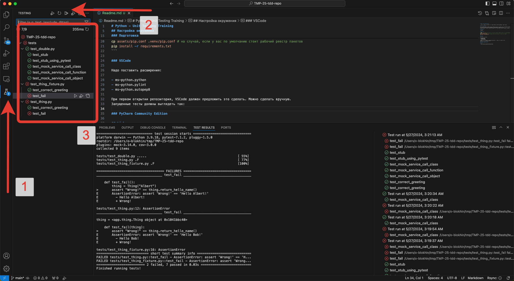

# Python - Unit Testing Training

Привет! Это репозиторий, на базе которого мы будем выполнять практические задания в рамках тренига.

## Настройка окружения

Вы можете использовать ваше текущее рабочеее окружение, если проект открывается в нём и у вас получается запустить тесты.
Если рабочего окружения нет или оно не подходит, то используйте инструкцию по настройке.
В рамках тренинга мы собираемся использовать PyCharm, но вы сможете следовать выполнять упражнения в VSCode, если это вам удобно.

### Требования

- python3

### Подготовка

```bash
python3 -m venv .venv # если у вас OS X в вы собираетесь использовать VSCode, стандартное расширение ms-python.python не поддерживает встроенный интерпретатор
source .venv/bin/activate
cp assets/pip.conf .venv/pip.conf # на случай, если у вас по умолчанию стоит рабочий реестр пакетов
pip install -r requirements.txt
```

### VSCode

Надо поставить расширения. При первом открытии репозитория, VSCode должен предложить это сделать. Можно сделать вручную.

- ms-python.python
- ms-python.pylint
- ms-python.autopep8

После запуска тестов, окружение должно выглядеть так. Часть тестов должны быть красными, это нормально.



### PyCharm Community Edition

## Links

- <https://github.com/swkBerlin/kata-bootstraps>
